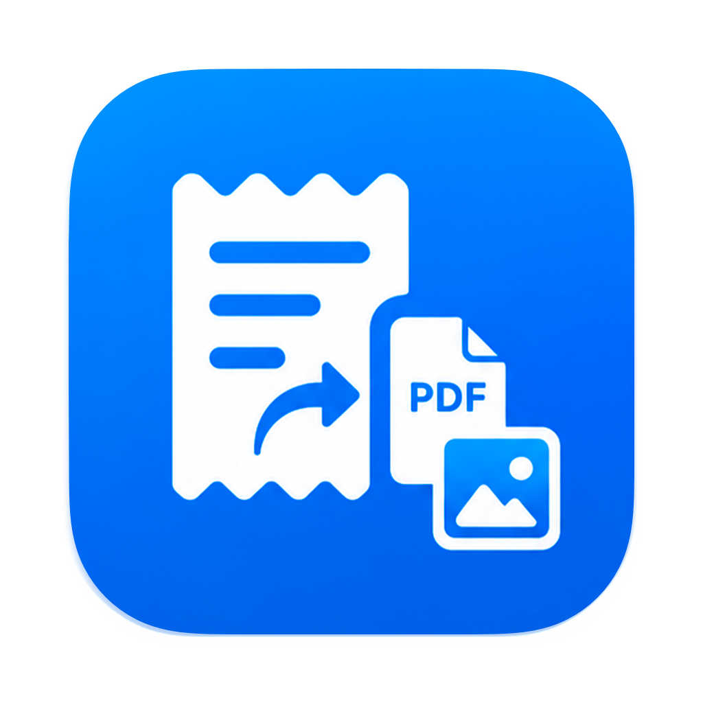
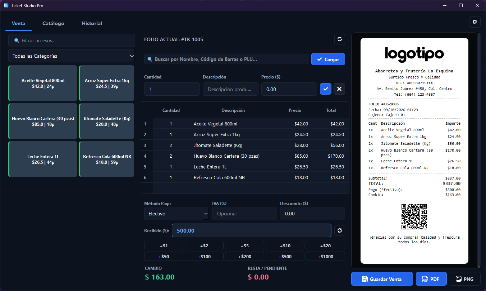
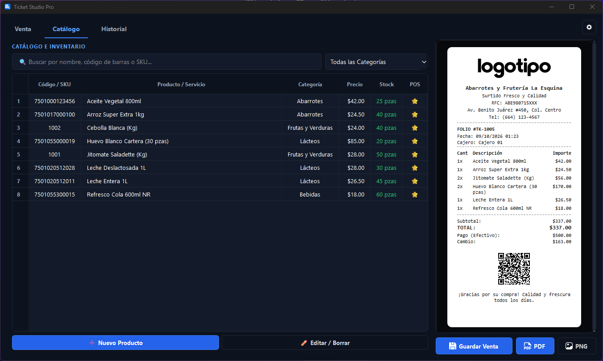
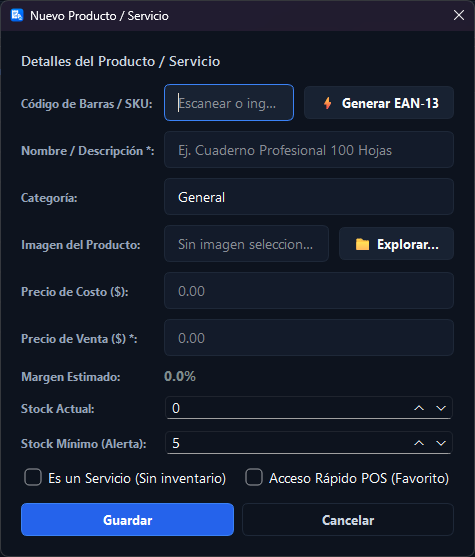
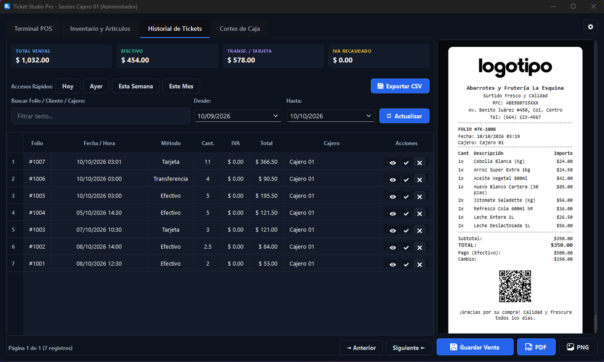
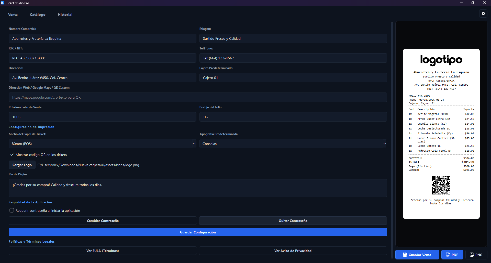

# 🎟️ Ticket Studio Pro

  

  ### **Sistema POS de Escritorio & Generación de Tickets Térmicos**
  *Una solución rápida, moderna y 100% offline diseñada para el control total de ventas e inventario.*

  
  
  

---

## 📌 Descripción General

**Ticket Studio Pro** es un sistema de Punto de Venta (POS) de escritorio con interfaz oscura moderna, rápida y adaptable. Está pensado para pequeños y medianos comercios que buscan emitir tickets de compra impresos o digitales en segundos, gestionar productos con código de barras y llevar un control claro de sus ingresos.

Este repositorio corresponde a la **versión de demostración del software y presentación del proyecto**.

---

## ✨ Características Principales

* 🚀 **Módulo de Venta Inmediata:** Cobro fluido en caja con calculo de cambio instantáneo, atajos rápidos de efectivo (`+$50`, `+$100`, etc.), acceso táctil a productos favoritos y búsqueda por lector de código de barras.
* 📄 **Tickets Termales de 80mm:** Renderizado en tiempo real de recibos con soporte para exportación directa a **PDF** o imágenes **PNG** de alta calidad.
* 🏷️ **Catálogo de Productos & Generador EAN-13:** Control de inventarios con sistema de alerta de stock mínimo, calculador automático de margen de ganancias e integración de generador de código de barras estándar **EAN-13**.
* 📊 **Historial Comercial & Exportación CSV:** Filtros de ingresos por rango de fechas, resumen de métodos de pago (Efectivo, Tarjeta, Transferencia), control de IVA retenido y exportación directa de reportes a Excel/CSV.
* 🎨 **Personalización Total:** Incorpora el logotipo de tu marca, datos fiscales (RFC/NIT), dirección, mensaje al pie de página y un **código QR dinámico** con enlace a Google Maps o redes sociales.
* 🔒 **100% Offline & Privado:** Arquitectura local basada en SQLite. Sin cobros mensuales ni dependencia de conexión a internet.

---

## 📸 Capturas de Pantalla e Interfaz

### 🛒 1. Módulo de Venta POS
> Interfaz optimizada para agilizar cobros continuos, selección rápida de productos y previsualización en tiempo real del ticket térmico.

---

### 📦 2. Catálogo e Inventario
> Vista de productos con indicadores visuales de stock, filtrado por categorías y vista previa del ticket comercial.

---

### ➕ 3. Formulario de Producto & Creador de Código de Barras EAN-13
> Alta de artículos con cálculo de margen estimado, definición de stock mínimo para alertas y generador automático de código EAN-13.

  

---

### 📈 4. Historial de Ventas & Totales
> Consulta de transacciones pasadas, desglose por IVA retenido, métodos de pago y exportación de reportes tabulares a CSV.

---

### ⚙️ 5. Configuración Comercial & Estilo del Ticket
> Configuración completa de la identidad del negocio: carga de logotipo, dirección, QR personalizado, fuentes y tamaño de papel.

---

## 🛠️ Stack Tecnológico

* **Lenguaje Principal:** Python 3.x
* **Interfaz Gráfica:** PyQt6 / PySide6 (Tema Oscuro Personalizado)
* **Base de Datos Local:** SQLite 3
* **Generación de Documentos:** ReportLab (Motor PDF) & Pillow (Exportación PNG)
* **Generador QR & Códigos:** QRCodegen & Python-Barcode

---

## 📄 Licencia

Este proyecto y sus materiales de demostración están bajo la Licencia **MIT**. Consulta el archivo `LICENSE` para más información.

Desarrollado para demostración técnica de **Ticket Studio Pro**.

